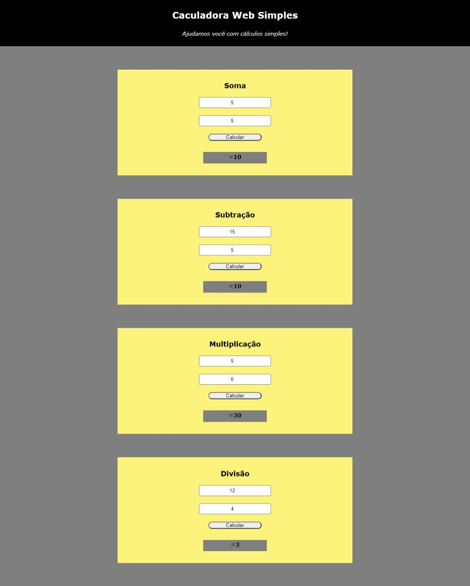

<h3>Calculadora Web 2.0</h3>

"Uma calculadora virtual simples e prática, mas que não te deixa na mão"

<h5>Objetivo</h5>
<li>Pratica de JS</li>
<li>Criar um ambiente com HTML, CSS e JS</li>

<h5>Sistema em funcionamento:</h5>
<section>
    

</section>
