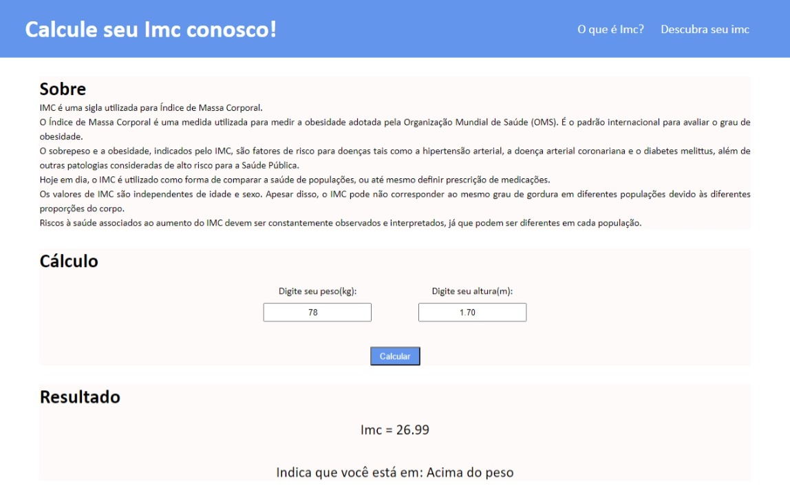

<h3>Calculadora de IMC</h3>

"Uma calculadora de índide de massa corporal virtual, que lhe diz seu nível de imc"

<h5>Objetivo</h5>
<li>Pratica de JS</li>
<li>Criar um ambiente com HTML, CSS e JS</li>

<h5>Sistema em funcionamento:</h5>
<section>
    

</section>
