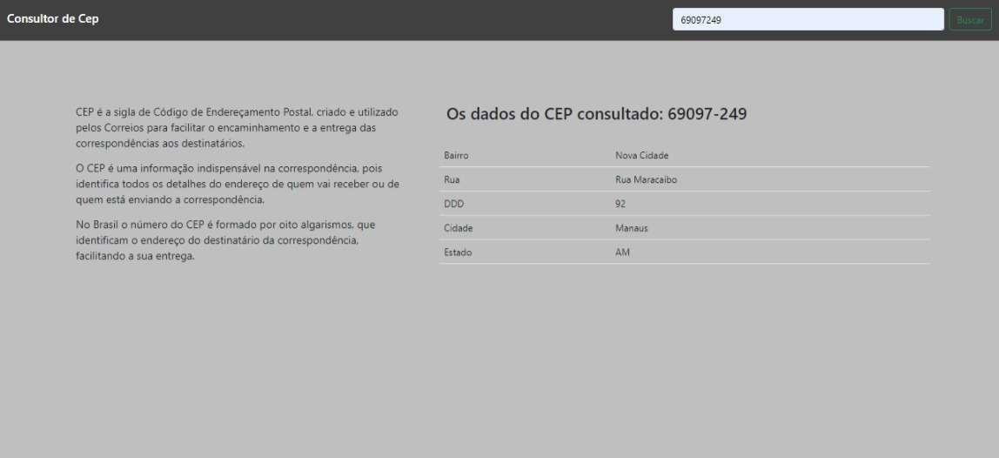

<h3>Consultor de CEP</h3>

"Um consultor de cep simples e dinâmico"

<h5>Objetivo</h5>
<li>Pratica de JQuery, Ajax e Bootstrap</li>
<li>Criar um ambiente com HTML, CSS, JS, JQuery e Bootstrap</li>

<h5>Sistema em funcionamento:</h5>
<section>
    

</section>